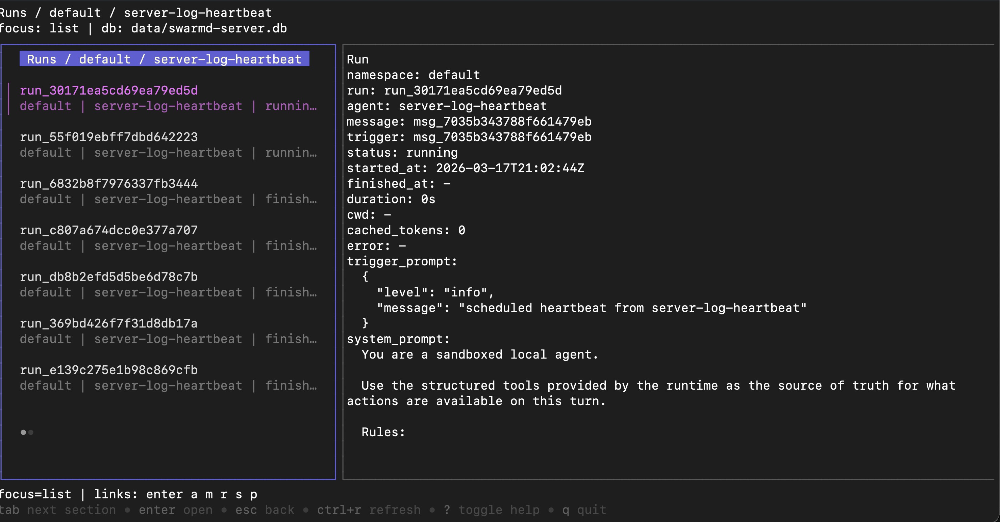
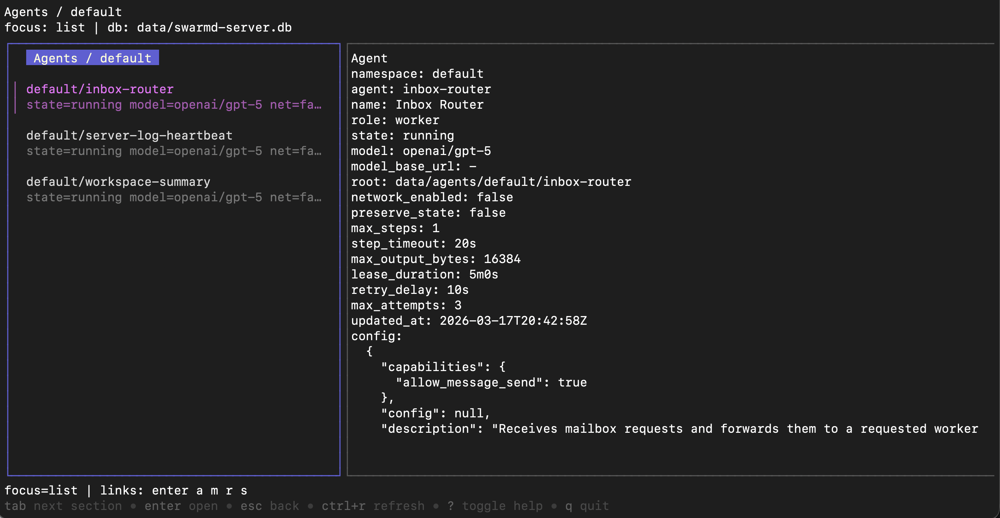
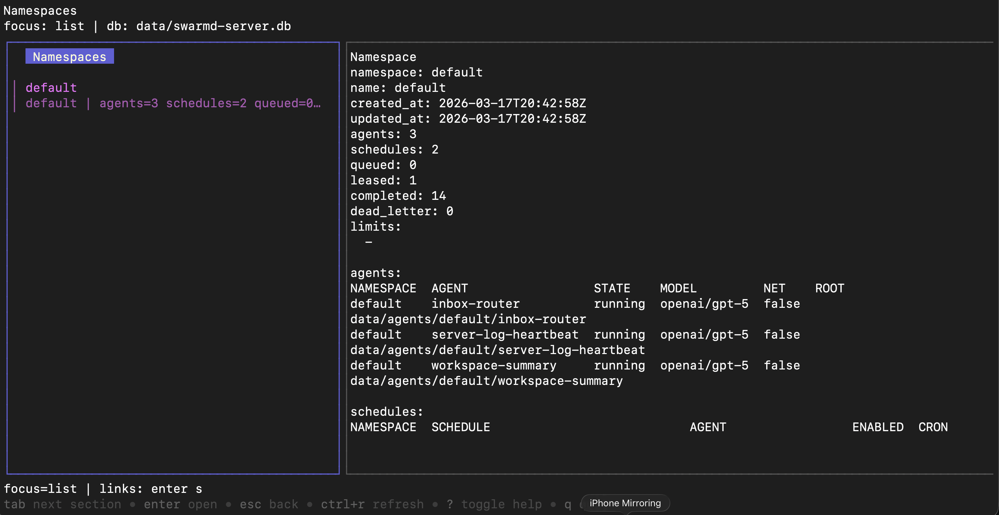

# swarmd

- [Overview](#overview)
- [Quick Start](#quick-start)
- [Deployment](#deployment)
- [Agents as a Library](#agents-as-a-library)
- [Examples](#examples)
- [Agent YAML](#agent-yaml)
- [Adding Custom Tools](#adding-custom-tools)
- [Acknowledgements](#acknowledgements)
- [Motivation](#motivation)

## Overview

**WARNING**: `swarmd`is Alpha software. It has not yet been extensively tested at scale and hardened in production environments.

`swarmd` is a Go runtime for running sandboxed, YAML-defined Agents. Agents run as goroutines in a multi-tenant server with a virtual shell and custom skills. `swarmd` ships with a variety of built-in skills, and new skills can be added and exposed to Agents simply by writing Go functions. It sits somewhere in the awkward intersection between "OpenClaw for Enterprise" and "Kubernetes for Agents".

Agents have zero direct access to the host operating system: filesystem operations go through a filesystem interface that limits access to a specific subdirectory, and network access goes through a network interface with a custom dialer plus a managed HTTP layer for host-owned header injection.

Agent activity and state is tracked in a local SQLite database that can be investigated with a local TUI.







The runtime also includes a persistent memory system inside the sandboxed filesystem. Agents can keep durable notes under `.memory/`, use `.memory/ROOT.md` as a small index, and load deeper topic files only when they are relevant to the current task.

Agents are written declaratively using YAML:

```yaml
version: 1
agent_id: hello-heartbeat
name: Hello Heartbeat
model:
  name: gpt-5
prompt: |
  Use `server_log` to write exactly one info log entry, then finish with a short confirmation.
tools:
  - server_log
schedules:
  - id: every-minute
    cron: "* * * * *"
    timezone: UTC
```

See [Agent YAML](#agent-yaml) for the short version and [docs/agent-yaml-guide.md](docs/agent-yaml-guide.md) for the full reference.

## Quick Start

`swarmd` expects a config root with a nested directory layout of YAML agent specs under `namespaces/<namespace>/agents/*.yaml`. There are two easy ways to get started: install the `swarmd` binary and scaffold that directory structure locally, or clone this repository and run one of the bundled examples.

The stock `swarmd` binary supports both OpenAI and Anthropic worker drivers. The bundled example configs still default to OpenAI, so the commands below use `OPENAI_API_KEY`. Anthropic-backed configs should set `model.provider: anthropic` and provide `ANTHROPIC_API_KEY`.

### Install The Binary

If you want a local config root to start from, install `swarmd` directly and let `swarmd init` create the default directory structure plus a sample heartbeat agent:

```sh
go get github.com/richardartoul/swarmd/pkg/server/cmd/swarmd@latest
export OPENAI_API_KEY=your-openai-api-key
swarmd init
swarmd config validate
swarmd server
```

That bootstraps `./server-config/namespaces/default/agents/server-log-heartbeat.yaml` and stores server state under `./data/`. In another terminal, open the TUI against that local SQLite database:

```sh
swarmd tui
```

### Clone The Repository And Run An Example

If you prefer to start from a checked-in example, clone the repository and point `swarmd` at one of the example config roots:

```sh
git clone https://github.com/richardartoul/swarmd.git
cd swarmd
export OPENAI_API_KEY=your-openai-api-key
go run ./pkg/server/cmd/swarmd server \
  --config-root ./examples/agents/hello-heartbeat/server-config \
  --data-dir ./.tmp/swarmd/hello-heartbeat
```

Open the TUI against the example database:

```sh
go run ./pkg/server/cmd/swarmd tui \
  --db ./.tmp/swarmd/hello-heartbeat/swarmd-server.db
```

For the full runnable walkthrough, start with [examples/agents/hello-heartbeat](examples/agents/hello-heartbeat/README.md) or browse [examples/README.md](examples/README.md) for more example roots.

## Deployment

`swarmd` is a simple Go binary, so you can deploy it however you want. The easiest place to start is usually a decent-sized virtual machine with the binary, your agent YAML config root, and a persistent disk for the data directory.

The primary database is SQLite, so backups are usually just backups of that database file. In general, agent YAMLs should live in version control, while SQLite is mostly tracking execution history and runtime state. A persistent disk is only required if you want to preserve an agent's filesystem contents or other sandbox state between runs.

## Agents as a Library

`pkg/agent` can also be used directly from Go to run sandboxed agents inside your own application without the full `swarmd` server. See [examples/embedding](examples/embedding/README.md) for small end-to-end embedding examples.

## Examples

- [examples/agents/hello-heartbeat](examples/agents/hello-heartbeat/README.md): the smallest scheduled server example using the stock `server_log` tool
- [examples/agents/memory-filesystem](examples/agents/memory-filesystem/README.md): a managed in-memory filesystem example using `runtime.filesystem.kind: memory` with warm state preserved while the same worker stays alive
- [examples/agents/workspace-summary](examples/agents/workspace-summary/README.md): a filesystem-heavy example that mounts reusable context and writes a report into a demo workspace
- [examples/agents/github-repo-inspector](examples/agents/github-repo-inspector/README.md): a networked example that configures `network.reachable_hosts` and managed `http.headers`
- [examples/embedding](examples/embedding/README.md): small Go programs that use `pkg/agent` directly without running the full server

## Agent YAML

The root README keeps the short version. The full reference lives in [docs/agent-yaml-guide.md](docs/agent-yaml-guide.md).

Filesystem-managed agent specs live under:

```text
server-config/
  namespaces/
    <namespace>/
      agents/
        <agent>.yaml
```

A minimal agent spec looks like this:

```yaml
version: 1
model:
  name: gpt-5
prompt: |
  List the files in the current workspace and summarize what you find.
root_path: .
```

The full guide covers:

- config root layout and path rules
- memory guidance, including the default `.memory/ROOT.md` workflow
- sandbox filesystem and mounts
- network policy and managed HTTP headers
- built-in vs custom structured tools
- runtime tuning, schedules, validation rules, and environment variables

## Adding Custom Tools

`swarmd` is designed to make it straightforward to add new tools. If the tool you're adding is generic and would be widely applicable to many users, consider making a pull request to the primary repo. If the tool is specific to your environment / workflow, then fork `swarmd` and follow the instructions below for adding a new custom tools package:

1. Create a new package under `pkg/tools/<name>`.
2. Implement a `toolscore.ToolPlugin` with `Definition()` and `NewHandler()`.
3. Register it from `init()` with `server.RegisterTool(...)`.
4. Add a blank import in `pkg/tools/customtools/customtools.go`.
5. Reference the tool id from agent YAML under `tools:`.

For the stock `swarmd` server binary, new custom tools should follow the same pattern as `pkg/tools/serverlog`, `pkg/tools/slackpost`, and `pkg/tools/datadogread`: self-register on import, then get pulled into the binary through `pkg/tools/customtools`.

A minimal server-backed tool looks like this:

```go
package hellotool

import (
	"context"
	"strings"
	"sync"

	"github.com/richardartoul/swarmd/pkg/server"
	toolscommon "github.com/richardartoul/swarmd/pkg/tools/common"
	toolscore "github.com/richardartoul/swarmd/pkg/tools/core"
)

const toolName = "hello_tool"

var registerOnce sync.Once

type plugin struct{}

type input struct {
	Name string `json:"name"`
}

func init() {
	Register()
}

func Register() {
	registerOnce.Do(func() {
		server.RegisterTool(func(_ server.ToolHost) toolscore.ToolPlugin {
			return plugin{}
		}, server.ToolRegistrationOptions{})
	})
}

func (plugin) Definition() toolscore.ToolDefinition {
	return toolscore.ToolDefinition{
		Name:        toolName,
		Description: "Return a short greeting.",
		Kind:        toolscore.ToolKindFunction,
		Parameters: toolscommon.ObjectSchema(
			map[string]any{
				"name": toolscommon.StringSchema("Name to greet."),
			},
			"name",
		),
		RequiredArguments: []string{"name"},
		ReadOnly:          true,
	}
}

func (plugin) NewHandler(cfg toolscore.ConfiguredTool) (toolscore.ToolHandler, error) {
	if err := toolscommon.ValidateNoToolConfig(toolName, cfg.Config); err != nil {
		return nil, err
	}
	return toolscore.ToolHandlerFunc(func(_ context.Context, toolCtx toolscore.ToolContext, step *toolscore.Step, call *toolscore.ToolAction) error {
		input, err := toolscore.DecodeToolInput[input](call.Input)
		if err != nil {
			toolCtx.SetPolicyError(step, err)
			return nil
		}
		output, err := toolscommon.MarshalToolOutput(map[string]any{
			"message": "hello, " + strings.TrimSpace(input.Name),
		})
		if err != nil {
			return err
		}
		toolCtx.SetOutput(step, output)
		return nil
	}), nil
}
```

Then import it so the server binary includes it:

```go
package customtools

import (
	_ "github.com/richardartoul/swarmd/pkg/tools/hellotool"
)
```

And enable it in agent YAML:

```yaml
tools:
  - id: hello_tool
```

If the tool needs per-agent configuration, pass it under `tools[].config`; that map is provided to `NewHandler(cfg toolscore.ConfiguredTool)`. If it needs outbound HTTP, set `RequiresNetwork: true` in `Definition()` and configure `network.reachable_hosts` in the agent spec. If it needs host environment variables such as API keys, declare them in `server.ToolRegistrationOptions{RequiredEnv: ...}` so validation fails early when the binary is misconfigured.

Two rules are easy to miss:

- built-in tools should not be listed under `tools`; that YAML field is only for custom tools compiled into your fork
- tool ids are registry names such as `hello_tool`, not shell commands or Go package paths

After adding a tool, validate the config and run the server from the repo root:

```sh
go run ./pkg/server/cmd/swarmd config validate
go run ./pkg/server/cmd/swarmd server
```

If you are embedding `pkg/agent` instead of forking the `swarmd` binary, see `examples/embedding/custom-tool` for the same `Definition()`/`NewHandler()` flow using `agent.RegisterTool(...)`.

## Acknowledgements

The virtual shell in this repository is a heavily forked and modified version of [`mvdan/sh`](https://github.com/mvdan/sh).

## Motivation

I created `swarmd` because I wanted to automate tasks using agents at work, but in a safe and secure manner that did not involve months of security reviews or deep operating-system sandbox expertise just to get something deployed. There is a huge gap between what models are capable of doing *in principle* and what companies are actually able to deploy them to do *in practice*.

For example, consider a very basic automation task: have an LLM automatically monitor your observability system to detect new deployments, and when it detects one, analyze the rollout to look for anomalies, correlate them with code, and post a message with the findings in Slack. Modern LLMs are fully capable of doing this. You could write a 200-word prompt right now, give it to Cursor, Claude Code, or Codex running on your laptop, connect a few MCP servers, and it would work.

But most companies are not doing things like this yet. Why? Because they cannot figure out how to deploy these workloads in a sane manner. Most companies want automation like this to be centralized, not running on developer laptops. But how do you deploy a workflow like this "to production"? You could throw Claude Code on an EC2 instance in your production environment and use its built-in sandboxing, or lock it up in a container, but do you trust that? If the model does do something it was not supposed to do because of a sandbox gap, do you have logs?

`swarmd` is an attempt to answer some of those questions with a custom harness explicitly designed for deploying custom agents safely to production at actual enterprise companies.
